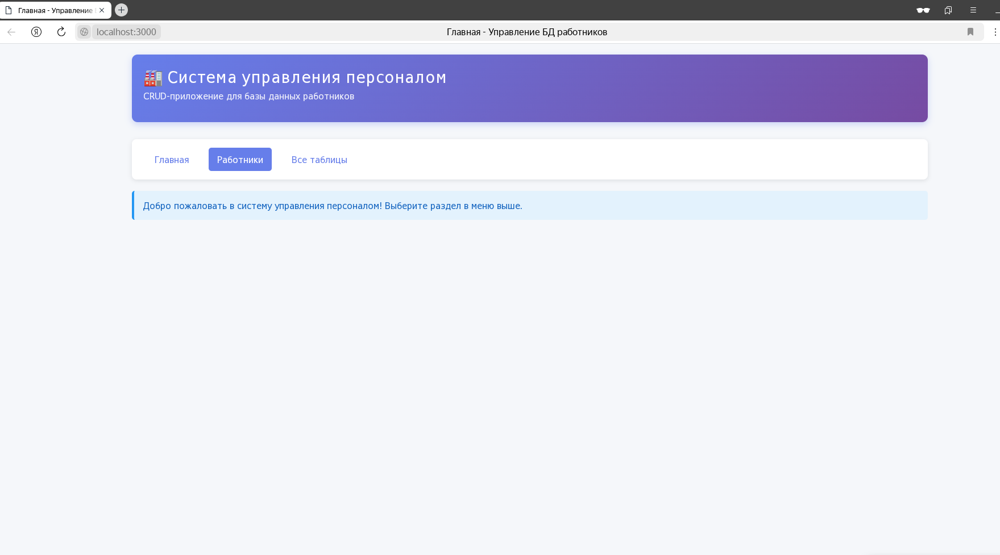
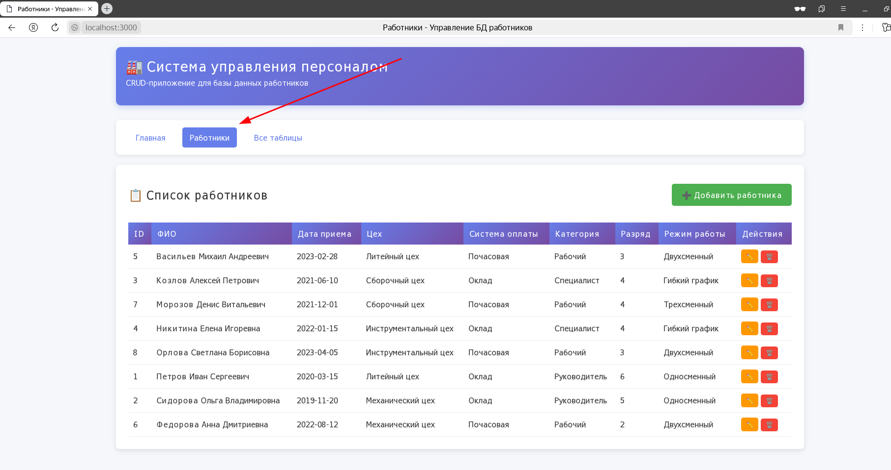
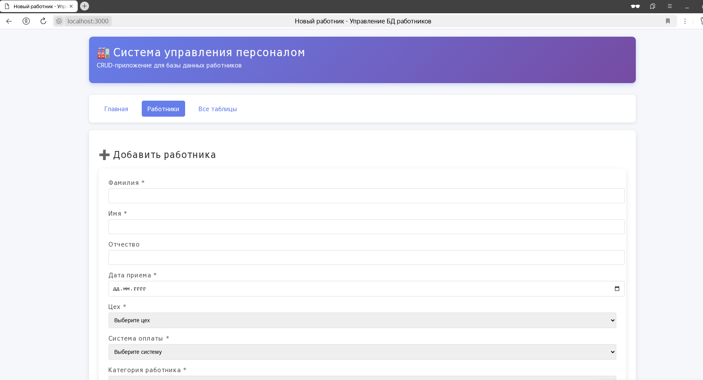

# 🏭 Система управления персоналом (CRUD-приложение на Clojure/Ring)

[](https://clojure.org/)
[](LICENSE)
[](https://github.com/ring-clojure/ring)
[](https://www.sqlite.org/)

**Система управления персоналом** — полноценное веб-приложение для управления базой данных работников предприятия с поддержкой всех операций CRUD (Create, Read, Update, Delete).

## 📸 Скриншоты

### Главная страница


### Список работников


### Форма добавления работника


### Форма редактирования


## ✨ Функциональность

### Основные возможности:
- ✅ **Просмотр** списка всех работников с расширенной информацией
- ✅ **Добавление** новых работников в базу данных
- ✅ **Редактирование** существующих записей
- ✅ **Удаление** работников с подтверждением
- ✅ **Умные формы** с выпадающими списками для справочников
- ✅ **Автоматическое переключение** между окладом и почасовой ставкой
- ✅ **Просмотр всех таблиц** базы данных
- ✅ **Современный адаптивный интерфейс**

### Работа со справочниками:
- 📋 Цеха
- 💰 Системы оплаты труда
- 👥 Категории работников
- 🔢 Разряды
- 🕐 Режимы работы
- 💸 Оклады
- ⏱️ Почасовые ставки

## 🛠 Технологический стек

| Технология | Версия | Назначение |
|------------|--------|------------|
| **Clojure** | 1.11.1 | Язык программирования |
| **Ring** | 1.9.6 | Web-фреймворк |
| **Compojure** | 1.7.0 | Роутинг |
| **Jetty** | - | Встроенный веб-сервер |
| **java.jdbc** | 0.7.12 | Работа с базой данных |
| **SQLite JDBC** | 3.42.0.0 | Драйвер SQLite |
| **SQLite** | 3.x | База данных |

## 📋 Требования

- **Java** 17 или выше
- **Leiningen** 2.10.0 или выше
- **SQLite** (встроен в приложение через JDBC)

## 🚀 Быстрый старт

### 1. Клонирование репозитория

```bash
git clone https://github.com/YOUR_USERNAME/my-ring-app.git
cd my-ring-app
