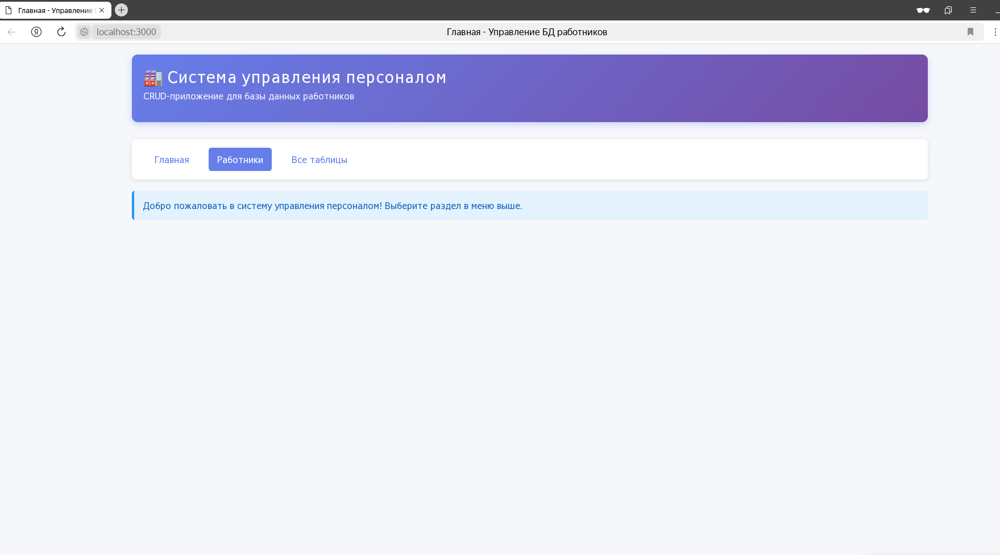
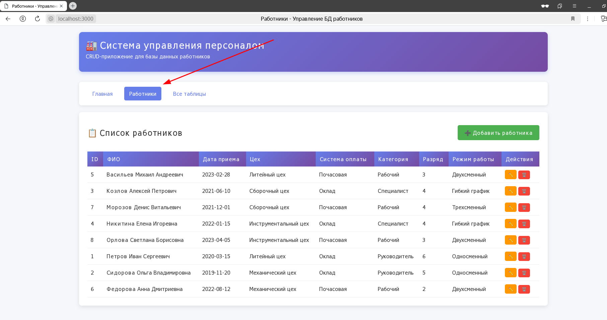
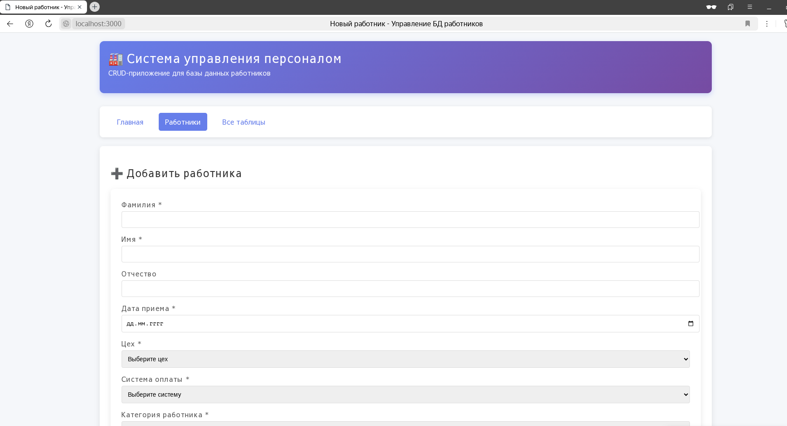
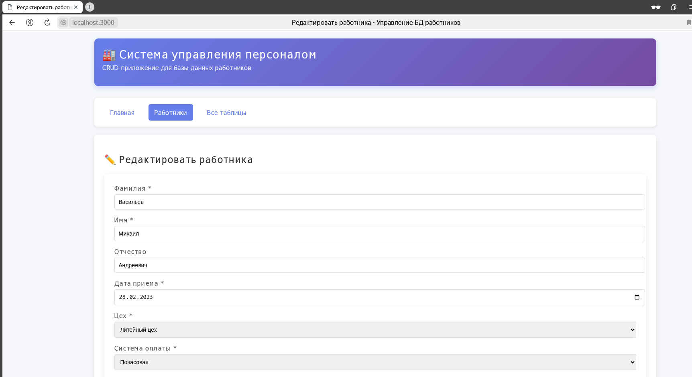

# 🏭 Система управления персоналом (CRUD-приложение на Clojure/Ring)

[](https://clojure.org/)
[](LICENSE)
[](https://github.com/ring-clojure/ring)
[](https://www.sqlite.org/)
[]()
[]()

**Система управления персоналом** — полноценное веб-приложение для управления базой данных работников предприятия с поддержкой всех операций CRUD (Create, Read, Update, Delete).

## 📑 Оглавление

- [О проекте](#-о-проекте)
- [Возможности](#-возможности)
- [Скриншоты](#-скриншоты)
- [Технологический стек](#-технологический-стек)
- [Быстрый старт](#-быстрый-старт)
- [Структура проекта](#-структура-проекта)
- [API Endpoints](#-api-endpoints)
- [База данных](#-база-данных)
- [Логирование](#-логирование)
- [Тестирование](#-тестирование)
- [Конфигурация](#-конфигурация)
- [Развёртывание](#-развёртывание)
- [Устранение проблем](#-устранение-проблем)
- [Вклад в проект](#-вклад-в-проект)
- [Лицензия](#-лицензия)
- [Автор](#-автор)

## 📸 Скриншоты

> **Примечание:** Если скриншоты не отображаются, проверьте наличие файлов в папке `screenshots/`

### Главная страница


### Список работников


### Форма добавления работника


### Форма редактирования


## 🎯 О проекте

**Система управления персоналом** — это полноценное веб-приложение для автоматизации кадрового учёта на предприятии.

### Проблемы, которые решает приложение:
- 📌 **Централизация данных** — вся информация о работниках в одном месте
- 📌 **Автоматизация расчётов** — расчёт зарплаты и учёта рабочего времени
- 📌 **Быстрый поиск** — мгновенный поиск по базе работников
- 📌 **Контроль изменений** — аудит всех операций с данными
- 📌 **Гибкость** — поддержка различных систем оплаты труда

### Целевая аудитория:
- Малые и средние предприятия
- Отделы кадров
- Бухгалтерии
- Руководители подразделений

## ✨ Функциональность

### Основные возможности:
- ✅ **Просмотр** списка всех работников с расширенной информацией
- ✅ **Добавление** новых работников в базу данных
- ✅ **Редактирование** существующих записей
- ✅ **Удаление** работников с подтверждением
- ✅ **Умные формы** с выпадающими списками для справочников
- ✅ **Автоматическое переключение** между окладом и почасовой ставкой
- ✅ **Просмотр всех таблиц** базы данных
- ✅ **Современный адаптивный интерфейс**
- ✅ **Поиск работников** по ФИО и цеху

### Работа со справочниками:
- 📋 Цеха
- 💰 Системы оплаты труда
- 👥 Категории работников
- 🔢 Разряды
- 🕐 Режимы работы
- 💸 Оклады
- ⏱️ Почасовые ставки

### Дополнительные функции:
- 📊 **Расчёт зарплаты** — просмотр информации о зарплате работника
- 🕐 **Учёт рабочего времени** — отслеживание отработанных часов, больничных и командировочных дней
- 🗄️ **Просмотр БД** — отображение всех таблиц базы данных с содержимым

## 🛠 Технологический стек

### Backend
| Технология | Версия | Назначение |
|------------|--------|------------|
| **Clojure** | 1.11.1 | Функциональный язык программирования на платформе JVM |
| **Ring** | 1.9.6 | Веб-фреймворк, абстракция над HTTP |
| **Compojure** | 1.7.0 | Библиотека маршрутизации для Ring |
| **Jetty** | 9.4.x | Встроенный веб-сервер |

### База данных
| Технология | Версия | Назначение |
|------------|--------|------------|
| **SQLite** | 3.x | Встраиваемая реляционная СУБД |
| **SQLite JDBC** | 3.45.1.0 | Драйвер для подключения к SQLite |
| **java.jdbc** | 0.7.12 | Clojure-библиотека для работы с JDBC |

### Логирование
| Технология | Версия | Назначение |
|------------|--------|------------|
| **SLF4J** | 2.0.9 | Фасад для логирования |
| **Logback** | 1.4.11 | Реализация логирования |
| **tools.logging** | 1.2.4 | Clojure-обёртка над SLF4J |

### Инфраструктура
| Инструмент | Назначение |
|------------|------------|
| **Leiningen** | Управление зависимостями и сборка |
| **Git** | Система контроля версий |

## 📋 Требования

| Зависимость | Минимальная версия | Рекомендуемая версия |
|-------------|-------------------|---------------------|
| **Java JDK** | 17 | 21 |
| **Leiningen** | 2.10.0 | 2.11.x |
| **SQLite** | 3.30 | 3.45+ |

### Проверка установленных зависимостей

```bash
# Проверка Java
java -version

# Проверка Leiningen
lein --version

# Проверка SQLite (опционально)
sqlite3 --version
```

### Установка зависимостей

#### Ubuntu/Debian
```bash
sudo apt update
sudo apt install openjdk-17-jdk sqlite3
```

#### macOS (Homebrew)
```bash
brew install openjdk@17 sqlite3
```

#### Windows
Скачайте и установите:
- [Java JDK](https://adoptium.net/)
- [SQLite](https://www.sqlite.org/download.html)

#### Установка Leiningen (все платформы)
```bash
# macOS/Linux
curl https://raw.githubusercontent.com/technomancy/leiningen/stable/bin/lein > /usr/local/bin/lein
chmod +x /usr/local/bin/lein

# Windows (через Chocolatey)
choco install leiningen
```

## 🚀 Быстрый старт

### 1. Клонирование репозитория

```bash
git clone https://github.com/alexandervashurin/my-ring-app.git
cd my-ring-app
```

### 2. Установка зависимостей

```bash
lein deps
```

> **Примечание:** Первая загрузка зависимостей может занять несколько минут

### 3. Подготовка базы данных

Убедитесь, что файл `igra.db` находится в корне проекта:

```bash
ls -la igra.db
```

Если базы данных нет, создайте её из дампа:

```bash
sqlite3 igra.db < igra.db.sql
```

### 4. Запуск приложения в режиме разработки

```bash
lein run
```

Приложение будет доступно по адресу: **http://localhost:3000**

> 💡 **Совет:** Для автоматического перезапуска при изменении кода используйте `lein ring server`

### 5. Сборка и запуск в виде JAR-файла (для продакшена)

#### Сборка

```bash
lein uberjar
```

Эта команда создаст два файла:

- `target/uberjar/my-ring-app-0.1.0-SNAPSHOT.jar` — обычный JAR
- `target/uberjar/my-ring-app-0.1.0-SNAPSHOT-standalone.jar` — standalone JAR со всеми зависимостями (используйте этот!)

#### Запуск

```bash
java -jar target/uberjar/my-ring-app-0.1.0-SNAPSHOT-standalone.jar
```

#### Настройка порта

По умолчанию приложение запускается на порту 3000. Чтобы изменить порт:

```bash
# Через переменную окружения
PORT=8080 java -jar target/uberjar/my-ring-app-0.1.0-SNAPSHOT-standalone.jar
```

---

## 🐳 Docker (опционально)

### Создание Docker-образа

Создайте файл `Dockerfile` в корне проекта:

```dockerfile
FROM eclipse-temurin:17-jdk-alpine

RUN apk add --no-cache leiningen sqlite

WORKDIR /app

COPY . .

RUN lein deps && lein uberjar

EXPOSE 3000

CMD ["java", "-jar", "target/uberjar/my-ring-app-0.1.0-SNAPSHOT-standalone.jar"]
```

### Сборка и запуск контейнера

```bash
# Сборка образа
docker build -t my-ring-app .

# Запуск контейнера
docker run -p 3000:3000 -v $(pwd)/logs:/app/logs my-ring-app
```

## 📁 Структура проекта

```
my-ring-app/
├── src/
│   └── my_ring_app/
│       ├── core.clj           # Точка входа, основной middleware
│       ├── routes.clj         # Маршруты (Compojure)
│       ├── controllers.clj    # Контроллеры (обработка запросов)
│       ├── model.clj          # Модель данных (работа с БД)
│       ├── validation.clj     # Валидация данных
│       ├── logger.clj         # Логирование
│       └── config.clj         # Конфигурация
│       └── views/
│           ├── layout.clj     # Общий HTML-шаблон
│           ├── home.clj       # Главная страница
│           ├── workers.clj    # Страница работников
│           ├── salary.clj     # Страница зарплаты
│           ├── work_time.clj  # Учёт рабочего времени
│           └── tables.clj     # Просмотр таблиц БД
├── resources/
│   └── logback.xml            # Конфигурация логгера
├── test/
│   └── my_ring_app/
│       ├── core_test.clj      # Интеграционные тесты
│       ├── model_test.clj     # Тесты модели
│       └── validation_test.clj # Тесты валидации
├── doc/
│   └── intro.md               # Документация
├── screenshots/               # Скриншоты интерфейса
├── logs/                      # Файлы логов (создаётся при запуске)
├── igra.db                    # База данных SQLite
├── igra.db.sql                # Дамп базы данных
├── project.clj                # Конфигурация Leiningen
└── README.md                  # Этот файл
```

## 🗄️ База данных

### Схема базы данных

Приложение использует следующие таблицы:

| Таблица | Описание |
|---------|----------|
| `Работник` | Основная информация о работниках |
| `Цех` | Справочник цехов предприятия |
| `Система_оплаты` | Справочник систем оплаты труда |
| `Категория_работника` | Категории работников (рабочий, специалист, руководитель) |
| `Разряд` | Тарифные разряды |
| `Режим_работы` | Режимы работы (односменный, двухсменный, etc.) |
| `Оклад` | Должностные оклады |
| `Почасовые_ставки` | Почасовые тарифные ставки |
| `Учет_рабочего_времени` | Записи об отработанном времени |
| `Начисление_заработной_платы` | Расчёты заработной платы |

### Работа с базой данных

```bash
# Просмотр структуры БД
sqlite3 igra.db ".schema"

# Просмотр всех таблиц
sqlite3 igra.db ".tables"

# Экспорт дампа
sqlite3 igra.db ".dump" > backup.sql

# Импорт из дампа
sqlite3 igra.db < backup.sql
```

## 🔒 Безопасность

### Реализованные механизмы защиты

| Механизм | Описание |
|----------|----------|
| **XSS-защита** | HTML-экранирование всех пользовательских данных |
| **Clickjacking** | Заголовок X-Frame-Options: DENY |
| **MIME-sniffing** | Заголовок X-Content-Type-Options: nosniff |
| **CSP** | Content-Security-Policy для ограничения источников скриптов |

### Рекомендации для продакшена

1. **Настройте HTTPS** через обратный прокси (nginx/Apache)
2. **Добавьте аутентификацию** для ограничения доступа
3. **Регулярно делайте бэкапы** базы данных
4. **Ограничьте доступ** к административным функциям
5. **Настройте firewall** для ограничения доступа к порту

## ⚡ Производительность

### Рекомендации по оптимизации

```bash
# Увеличьте память JVM для продакшена
java -Xms512m -Xmx2g -jar target/uberjar/my-ring-app-0.1.0-SNAPSHOT-standalone.jar
```

### Масштабирование

Для работы с большой нагрузкой рассмотрите:

- **Кэширование** часто запрашиваемых данных (справочники)
- **Миграция на PostgreSQL** для больших объёмов данных
- **Балансировщик нагрузки** для нескольких экземпляров
- **CDN** для статических ресурсов

Приложение использует **Logback** для логирования всех событий.

### Типы логов

| Файл | Описание | Расположение |
|------|----------|--------------|
| **app.log** | Все логи приложения | `logs/app.log` |
| **error.log** | Только ошибки | `logs/error.log` |
| **audit.log** | Аудит действий пользователей | `logs/audit.log` |
| **app-{дата}.log** | Архивные логи (ежедневная ротация) | `logs/` |

### Уровни логирования

| Уровень | Описание |
|---------|----------|
| **DEBUG** | Отладочная информация (SQL-запросы, детали) |
| **INFO** | Общая информация о работе приложения |
| **WARN** | Предупреждения (валидация не пройдена, запись не найдена) |
| **ERROR** | Ошибки (исключения, сбои) |

### Примеры логов

```
2026-02-05 15:30:45.123 [main] INFO my-ring-app.core - Сервер запускается на порту 3000
2026-02-05 15:31:20.456 [qtp534199755-20] INFO my-ring-app.logger - REQUEST: GET /workers | IP: 127.0.0.1
2026-02-05 15:31:20.789 [qtp534199755-20] INFO my-ring-app.logger - RESPONSE: 200 /workers
2026-02-05 15:32:10.234 [qtp534199755-22] INFO my-ring-app.audit - ACTION: CREATE | ENTITY: Worker | ID: 9 | DETAILS: Создан работник Иванов Петр
2026-02-05 15:33:45.678 [qtp534199755-24] ERROR my-ring-app.logger - ERROR: SQL error | MESSAGE: Ошибка при создании записи
```

### Просмотр логов

```bash
# Просмотр всех логов в реальном времени
tail -f logs/app.log

# Просмотр только ошибок
tail -f logs/error.log

# Просмотр аудита действий
tail -f logs/audit.log
```

Конфигурация логгера находится в файле `resources/logback.xml`.

## 🧮 API Endpoints

| Метод | Путь | Описание |
|-------|------|----------|
| `GET` | `/` | Главная страница |
| `GET` | `/workers` | Список всех работников (с поиском) |
| `GET` | `/workers/new` | Форма создания работника |
| `POST` | `/workers/create` | Создание работника |
| `GET` | `/workers/:id/edit` | Форма редактирования работника |
| `POST` | `/workers/:id/update` | Обновление работника |
| `POST` | `/workers/:id/delete` | Удаление работника |
| `GET` | `/workers/:id/salary` | Зарплата работника |
| `GET` | `/workers/:id/work-time` | Учёт рабочего времени |
| `GET` | `/work-time/:id/edit` | Редактирование учёта времени |
| `POST` | `/work-time/:id/update` | Обновление учёта времени |
| `GET` | `/db` | Просмотр всех таблиц БД |

## 🔧 Устранение проблем

### Частые ошибки и их решение

#### 1. Ошибка: "Could not find artifact"

```bash
# Очистите кэш и переустановите зависимости
lein clean
lein deps
```

#### 2. Ошибка: "Port already in use"

```bash
# Найдите процесс на порту 3000
lsof -i :3000

# Завершите процесс
kill -9 <PID>

# Или используйте другой порт
PORT=8080 lein run
```

#### 3. Ошибка: "Database is locked"

```bash
# Убедитесь, что нет других процессов, работающих с БД
lsof igra.db

# Проверьте права доступа
chmod 644 igra.db
```

#### 4. Ошибка: "Java heap space"

```bash
# Увеличьте память JVM
export JVM_OPTS="-Xmx1g"
lein run
```

#### 5. Ошибка компиляции AOT

```bash
# Полная очистка и пересборка
rm -rf target
lein clean
lein uberjar
```

### Логи для отладки

```bash
# Включите DEBUG-логирование
# Откройте resources/logback.xml и измените уровень:
<root level="DEBUG">

# Просмотр логов в реальном времени
tail -f logs/app.log
```

## 🧪 Тестирование

### Запуск всех тестов

```bash
lein test
```

### Запуск тестов с отладочной информацией

```bash
lein test :verbose
```

### Покрытие кода тестами

```bash
# Установите lein-coverage
lein install plugin lein-coverage "0.2.1"

# Запуск с покрытием
lein coverage
```

### Написание тестов

Тесты находятся в `test/my_ring_app/`:

- **validation_test.clj** — тесты валидации (13 тестов)
- **model_test.clj** — тесты модели (5 тестов)
- **core_test.clj** — интеграционные тесты (3 теста)

Пример теста:

```clojure
(deftest test-validate-worker-valid
  (testing "Валидные данные работника"
    (is (:valid? (validate-worker {:фамилия "Иванов"
                                   :имя "Иван"
                                   :дата_приема "2024-01-01"
                                   :цех_id "1"})))))
```

### Статус тестов

| Файл | Тестов | Утверждений | Статус |
|------|--------|-------------|--------|
| validation_test.clj | 13 | 32 | ✅ |
| model_test.clj | 5 | 8 | ✅ |
| core_test.clj | 3 | 10 | ✅ |
| **Итого** | **18** | **50** | **✅** |

## 🚀 Развёртывание

### Развёртывание на Linux-сервере

#### 1. Подготовка сервера

```bash
# Установка Java и SQLite
sudo apt update
sudo apt install openjdk-17-jdk sqlite3

# Создание пользователя для приложения
sudo useradd -m -s /bin/bash myringapp
sudo mkdir -p /opt/my-ring-app
sudo chown myringapp:myringapp /opt/my-ring-app
```

#### 2. Копирование приложения

```bash
# Копируйте standalone JAR на сервер
scp target/uberjar/my-ring-app-0.1.0-SNAPSHOT-standalone.jar myringapp@server:/opt/my-ring-app/

# Копируйте базу данных
scp igra.db myringapp@server:/opt/my-ring-app/
```

#### 3. Создание systemd-сервиса

Создайте файл `/etc/systemd/system/my-ring-app.service`:

```ini
[Unit]
Description=My Ring App - HR Management System
After=network.target

[Service]
Type=simple
User=myringapp
WorkingDirectory=/opt/my-ring-app
ExecStart=/usr/bin/java -Xms512m -Xmx1g -jar /opt/my-ring-app/my-ring-app-0.1.0-SNAPSHOT-standalone.jar
Restart=on-failure
Environment="PORT=3000"
Environment="ENV=production"

# Логирование
StandardOutput=journal
StandardError=journal
SyslogIdentifier=my-ring-app

[Install]
WantedBy=multi-user.target
```

#### 4. Запуск сервиса

```bash
# Перезагрузка systemd
sudo systemctl daemon-reload

# Включение автозапуска
sudo systemctl enable my-ring-app

# Запуск
sudo systemctl start my-ring-app

# Проверка статуса
sudo systemctl status my-ring-app

# Просмотр логов
journalctl -u my-ring-app -f
```

### Развёртывание с nginx (reverse proxy)

#### 1. Установка nginx

```bash
sudo apt install nginx
```

#### 2. Конфигурация nginx

Создайте файл `/etc/nginx/sites-available/my-ring-app`:

```nginx
server {
    listen 80;
    server_name your-domain.com;

    location / {
        proxy_pass http://localhost:3000;
        proxy_set_header Host $host;
        proxy_set_header X-Real-IP $remote_addr;
        proxy_set_header X-Forwarded-For $proxy_add_x_forwarded_for;
        proxy_set_header X-Forwarded-Proto $scheme;
    }

    # Статические файлы (опционально)
    location /static {
        alias /opt/my-ring-app/resources/public;
        expires 30d;
    }
}
```

#### 3. Включение сайта

```bash
sudo ln -s /etc/nginx/sites-available/my-ring-app /etc/nginx/sites-enabled/
sudo nginx -t
sudo systemctl reload nginx
```

#### 4. Настройка HTTPS (Let's Encrypt)

```bash
sudo apt install certbot python3-certbot-nginx
sudo certbot --nginx -d your-domain.com
```

## 📊 Мониторинг

### Проверка работоспособности

```bash
# Проверка доступности приложения
curl -I http://localhost:3000

# Проверка статуса сервиса
sudo systemctl status my-ring-app

# Просмотр логов в реальном времени
journalctl -u my-ring-app -f
```

### Метрики для мониторинга

- **HTTP статус коды** (ошибки 4xx, 5xx)
- **Время ответа** (среднее, 95-й перцентиль)
- **Использование памяти** (heap/non-heap)
- **Активные подключения** к БД
- **Размер базы данных**

## 🔧 Конфигурация

### Переменные окружения

| Переменная | Значение по умолчанию | Описание |
|------------|----------------------|----------|
| `PORT` | `3000` | Порт веб-сервера |
| `ENV` | `development` | Окружение (development/production) |
| `JVM_OPTS` | `-` | Опции JVM (например, `-Xmx1g`) |

### Конфигурация логгера

Файл: `resources/logback.xml`

```xml
<configuration>
  <appender name="STDOUT" class="ch.qos.logback.core.ConsoleAppender">
    <encoder>
      <pattern>%d{yyyy-MM-dd HH:mm:ss.SSS} [%thread] %-5level %logger{36} - %msg%n</pattern>
    </encoder>
  </appender>

  <root level="INFO">
    <appender-ref ref="STDOUT" />
  </root>
</configuration>
```

## ❓ FAQ (Частые вопросы)

### Как изменить порт по умолчанию?

```bash
# Через переменную окружения
PORT=8080 lein run

# Или при запуске JAR
java -Dport=8080 -jar app.jar
```

### Как создать резервную копию базы данных?

```bash
# Экспорт в SQL-файл
sqlite3 igra.db ".dump" > backup-$(date +%Y%m%d).sql

# Или копирование файла БД
cp igra.db igra.db.backup
```

### Как сбросить базу данных к начальному состоянию?

```bash
# Удаление текущей БД
rm igra.db

# Создание из дампа
sqlite3 igra.db < igra.db.sql
```

### Как добавить нового пользователя в базу?

Используйте веб-интерфейс:
1. Откройте http://localhost:3000
2. Нажмите "Работники" → "Добавить работника"
3. Заполните форму и сохраните

### Можно ли использовать PostgreSQL вместо SQLite?

Да, но потребуется:
1. Добавить зависимость `[org.postgresql/postgresql "42.6.0"]` в `project.clj`
2. Изменить `config.clj` для подключения к PostgreSQL
3. Мигрировать схему БД

### Как обновить приложение в продакшене?

```bash
# 1. Собрать новую версию
lein uberjar

# 2. Копировать на сервер
scp target/uberjar/*.jar user@server:/opt/my-ring-app/

# 3. Перезапустить сервис
sudo systemctl restart my-ring-app
```

## 🤝 Вклад в проект

Приветствуется любой вклад в развитие проекта!

### Как внести свой вклад

1. Создайте форк репозитория
2. Создайте ветку для вашей фичи (`git checkout -b feature/amazing-feature`)
3. Убедитесь, что тесты проходят (`lein test`)
4. Закоммитьте изменения (`git commit -m 'Add amazing feature'`)
5. Отправьте в ветку (`git push origin feature/amazing-feature`)
6. Откройте Pull Request

### Требования к коду

- Следуйте [Clojure Style Guide](https://github.com/bbatsov/clojure-style-guide)
- Добавляйте тесты для нового функционала
- Документируйте публичные функции
- Обновляйте README.md при изменении API

### Идеи для улучшения

- [ ] Добавить аутентификацию и авторизацию
- [ ] Реализовать REST API для интеграции
- [ ] Добавить экспорт данных в CSV/Excel
- [ ] Реализовать печать отчётов
- [ ] Добавить дашборд с метриками
- [ ] Поддержка мультиязычности
- [ ] Миграция на PostgreSQL

## 📄 Лицензия

Распространяется по лицензии **Eclipse Public License 2.0** (см. файл [LICENSE](LICENSE)).

## 👤 Автор

**Alexander Vashurin**

## 📞 Контакты

- GitHub: [@alexandervashurin](https://github.com/alexandervashurin)
- Email: [alexandervashurin@yandex.ru](mailto:alexandervashurin@yandex.ru)

## 📈 Статус проекта

| Параметр | Значение |
|----------|----------|
| **Версия** | 0.1.0-SNAPSHOT |
| **Статус** | Production Ready |
| **Последнее обновление** | Февраль 2026 |
| **Тесты** | 18 тестов, 50 утверждений ✅ |
| **Сборка** | []() |

## 🙏 Благодарности

- [Ring](https://github.com/ring-clojure/ring) — веб-фреймворк для Clojure
- [Compojure](https://github.com/weavejester/compojure) — библиотека маршрутизации
- [Clojure](https://clojure.org/) — язык программирования
- [Leiningen](https://leiningen.org/) — управление проектами

## 📚 Дополнительные ресурсы

- [Clojure для начинающих](https://clojure-doc.org/)
- [Ring Tutorial](https://github.com/ring-clojure/ring/wiki/Tutorial)
- [Compojure Wiki](https://github.com/weavejester/compojure/wiki)
- [ClojureDocs](https://clojuredocs.org/) — документация и примеры

---

<div align="center">
  <strong>🏭 Система управления персоналом</strong><br>
  CRUD-приложение на Clojure/Ring для управления базой данных работников
</div>

<div align="center">

[Вверх](#-система-управления-персоналом-crud-приложение-на-clojurering)

</div>
